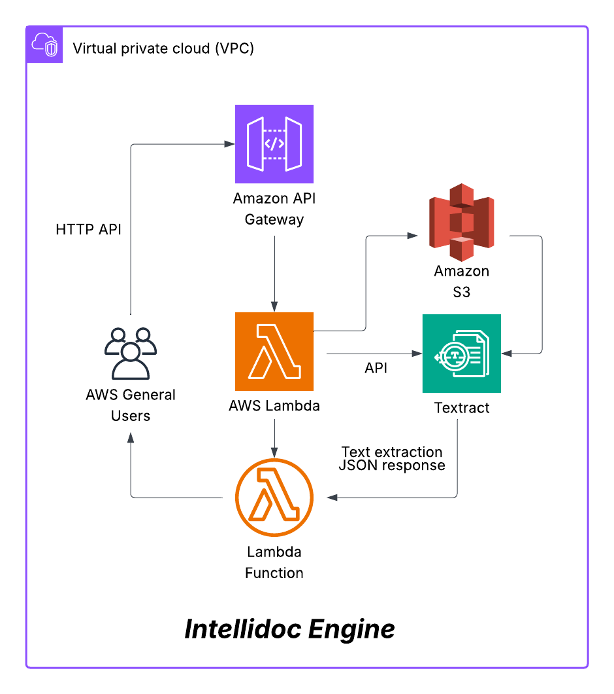

# 🧠 IntelliDoc Engine

**IntelliDoc Engine** is a lightweight, serverless OCR processing pipeline on AWS. It accepts a base64 encoded PDF via an HTTP API, stores it in S3, runs Textract to extract text, and returns structured JSON.

Built for simplicity, cost efficiency, and clean architecture with a future-ready path for secure VPC deployment.

## 🎯 Why I Built This

To explore how serverless document automation can be built from the ground up securely, affordably, and without vendor lock in.  
This project is part of my AWS portfolio to demonstrate real infrastructure as code, API integration, and hands on debugging in action.


---

## 🧱 Architecture

```
📄 [View Architecture Diagram (PDF)](./intellidoc-diagram.pdf)



```


> 💡 This diagram reflects the current optimized deployment (no VPC) with optional VPC secure variant described below.

---
## 🚀 Features

- 📄 Accepts base64 encoded PDFs via public HTTP endpoint
- ☁️ Stores documents in Amazon S3
- 🔍 Uses Amazon Textract to extract structured text
- 🔁 Returns clean, readable JSON
- 🧱 Deployed entirely via Terraform for reproducibility

---

## 📦 Sample Payload

```json
{
  "filename": "real-test.pdf",
  "filedata": "JVBERi0xLjQKJe..."
}
```

---

## 🧪 How It Works

1. Users send a POST request to the API Gateway with a base64 encoded PDF.
2. Lambda decodes and stores the file in S3.
3. Textract analyzes the file via S3 reference.
4. Extracted text is returned to the user as a clean JSON array.

---

## 📁 Project Structure

```
Intellidoc-Engine/
├── action/                        # GitHub Actions or automation scripts (if used)
├── lambda/                        # Lambda source code and test files
│   ├── base64.txt
│   ├── lambda.zip
│   ├── nlp_parser.py
│   ├── ocr_processor.py
│   ├── ocr_processor.zip
│   ├── payload.json
│   └── requirements.txt
├── terraform/                     # Root Terraform configuration
│   ├── .terraform/
│   ├── lambda/
│   ├── modules/                   # Custom Terraform modules
│   │   ├── api_gateway/
│   │   ├── lambda/
│   │   ├── s3/
│   │   └── vpc/
│   ├── base64.txt
│   ├── clean.b64
│   ├── main.tf
│   ├── outputs.tf
│   ├── payload.json
│   ├── real-test.b64
│   ├── real-test.pdf
│   ├── terraform.tfstate
│   ├── terraform.tfstate.backup
│   └── variables.tf
├── .gitignore
├── LICENSE
├── README.md
├── base64.txt
├── bucket-policy.json
├── Intellidoc-diagram.pdf
├── nlp_parser.py
├── ocr_processor.py
├── ocr_processor.zip
└── requirements.txt

```

🛠️ Troubleshooting
Internal Server Error (500) from API Gateway
→ Check CloudWatch logs for Lambda exceptions. Ensure ocr_processor.py runs correctly and payload.json contains valid base64 PDF.

Textract Access Denied
→ Confirm Lambda role has textract:* and proper S3 permissions (s3:GetObject, s3:PutObject, s3:ListBucket).

S3 Upload Issues
→ Verify correct bucket name, object key, and that files are actually uploaded. Add debug logs in Lambda.

Terraform Module Errors
→ Ensure module paths are correct and run terraform init before apply.

Missing or Broken Lambda Zip
→ Rebuild with PowerShell:
Compress-Archive -Path ocr_processor.py -DestinationPath ocr_processor.zip -Force

---

## 🔒 Future: VPC-Secure Variant

This project was intentionally deployed with a **public Lambda** to prioritize:
- ⏱️ Fast cold start time
- 💸 Zero NAT Gateway cost
- 🧪 Easy local + remote testing

For enterprise or compliance heavy environments, it can be upgraded with:
- VPC attached Lambda in private subnets
- NAT Gateway for outbound Textract access
- Fully isolated, audit compliant architecture

This variant is planned as a **future branch** of IntelliDoc Engine.

---

## 📜 License

This project is licensed under the MIT License see [`LICENSE`](./LICENSE) for details.

---

## 🧠 Author Notes
> This project represents 20+ hours of focused work building, testing, and refining infrastructure from scratch.  
> Every piece was handcrafted for real world scenarios, not for show. No shortcuts.  
> Just clean cloud architecture built with intent and care.
